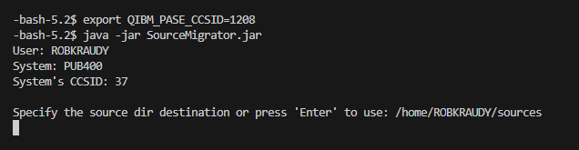

# Intro

The current trend on IBM i is the DevOps Path with a CI/CD Pipeline. Most IBM I Shops use Source PF to store their source code. 

Source PF are unique data structures of the IBM I Operating system, this means, it is hard to integrate them with modern DevOps technologies. For that, a compatible representation is needed: The stream file.

How to migrate thousands of source members with their corresponding dir struct (library/sourcePf/member) and correct character conversion to Stream Files in the IFS in a reasonable time without dealing with dependency issues in a download-and-run fashion and using only open-source tools?

For that, I created **SourceMigrator**. It is a simple and minimal migration tool with a better than linear time for large code bases. If you look at the code, there is an obvious part where the migration could be made closer to O(log n). It was created to be interacted with through a PASE shell but you could easily adjust it for your needs if you want it to run in a batch job, for example.

## Set up

Download the `.jar` file from the repo release

Upload the `.jar` file to PASE IFS using FTP or simply drag and drop with Code4i

## Run

Open PASE terminal with Code4i

Set terminal ccsid: `export QIBM_PASE_CCSID=1208`
Run tool: `java -jar SourceMigrator.jar`

## Migration

`Enter` to use the default migration dir `sources`
`Enter` to look for source Pf in your curlib
`Enter` again to show the list of source pf in your library

`Enter` one last time to migrate all the members of the listed source pf

Here you will see the output and the statistics at the end

Under `sources/` you should see the migrated dir struct

That's it.

##
