# Intro

The current trend on IBM i is the DevOps Path with a CI/CD Pipeline. Most IBM I Shops use Source PF to store their source code. 

Source PF are unique data structures of the IBM I Operating system, this means, it is hard to integrate them with modern DevOps technologies. For that, a compatible representation is needed: The stream file.

How to migrate thousands of source members with their corresponding dir struct (library/sourcePf/member) and correct character conversion to Stream Files in the IFS in a reasonable time without dealing with dependency issues in a download-and-run fashion and using only open-source tools?

For that, I created **SourceMigrator**. It is a simple and minimal migration tool with a better than linear time for large code bases. It can be run interactively without input params or non-interactively by specifying them. You should also be able to add it as a package.

## Set up

Download the `.jar` file from the repo release

Upload the `.jar` file to PASE IFS using FTP or simply drag and drop with Code4i

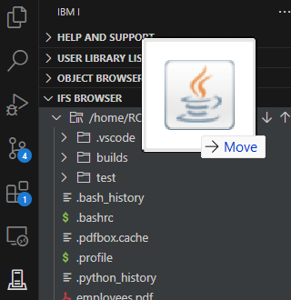

Open PASE terminal with Code4i

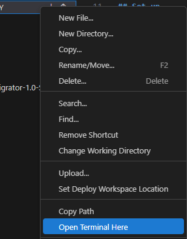

Set terminal ccsid: `export QIBM_PASE_CCSID=1208` *(Optional)*

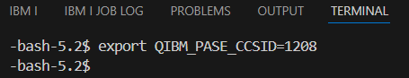

## Non-Interactive Migration

Specific library
`java -jar SourceMigrator.jar relative_dir library`

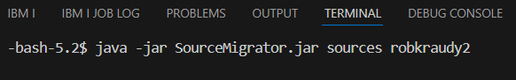

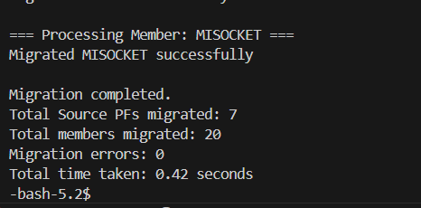

Specific source pf
`java -jar SourceMigrator.jar relative_dir library sourcePf`

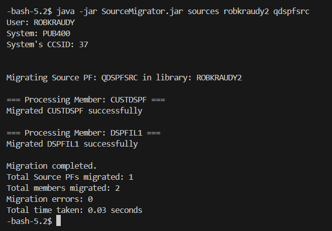

Specific source pf to full destination
`java -jar SourceMigrator.jar /dir/dir/relative_dir library sourcePf`

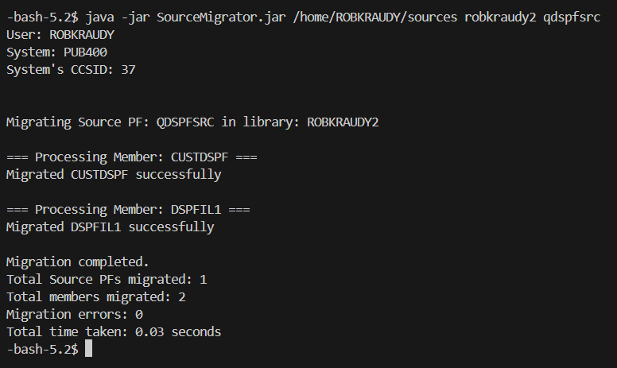

## Interactive Migration

Run tool: `java -jar SourceMigrator.jar`

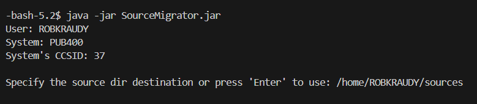

`Enter` to use the default migration dir `sources`
`Enter` to look for source Pf in your curlib
`Enter` again to show the list of source pf in your library

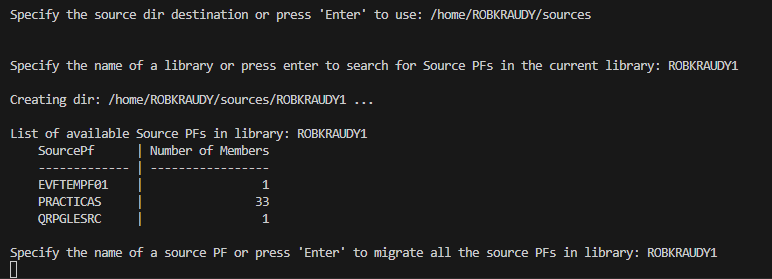

`Enter` one last time to migrate all the members of the listed source pf

Here you will see the output and the statistics at the end

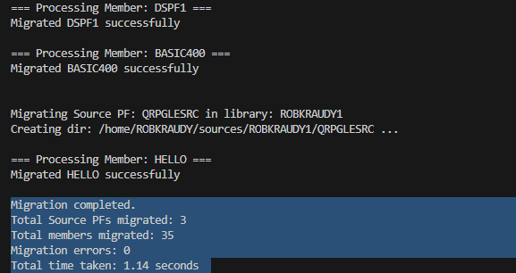

Under `sources/` you should see the migrated dir struct

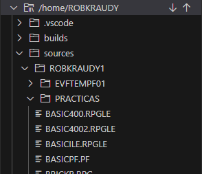
